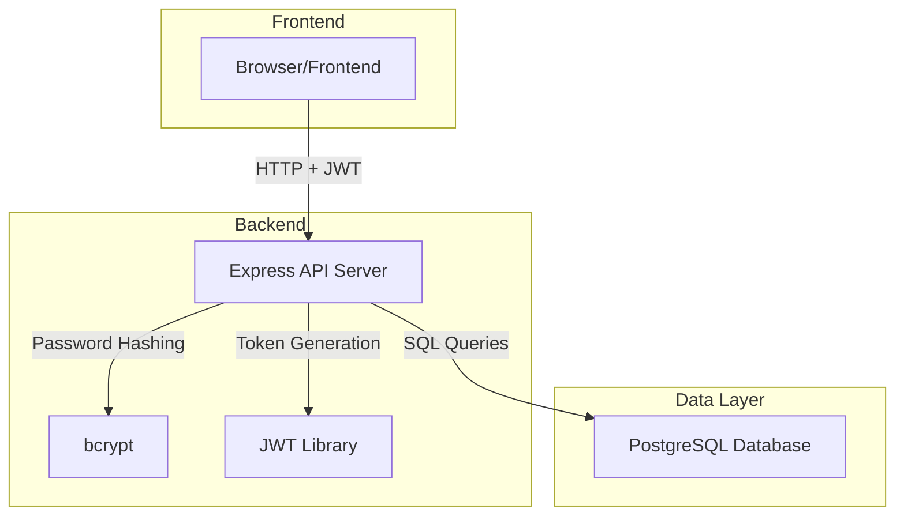
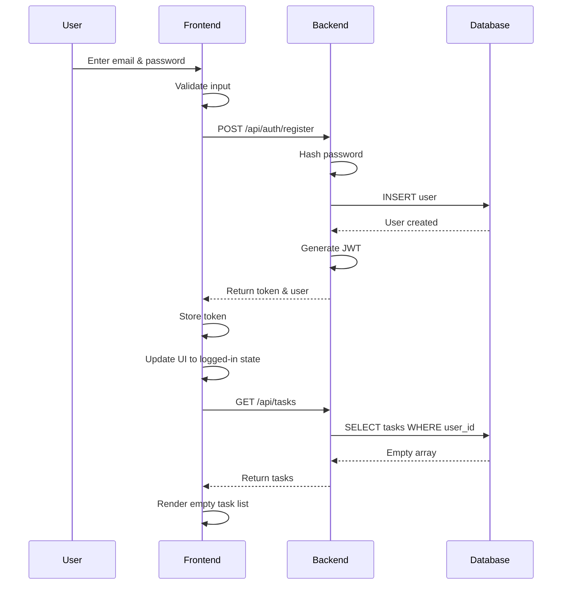
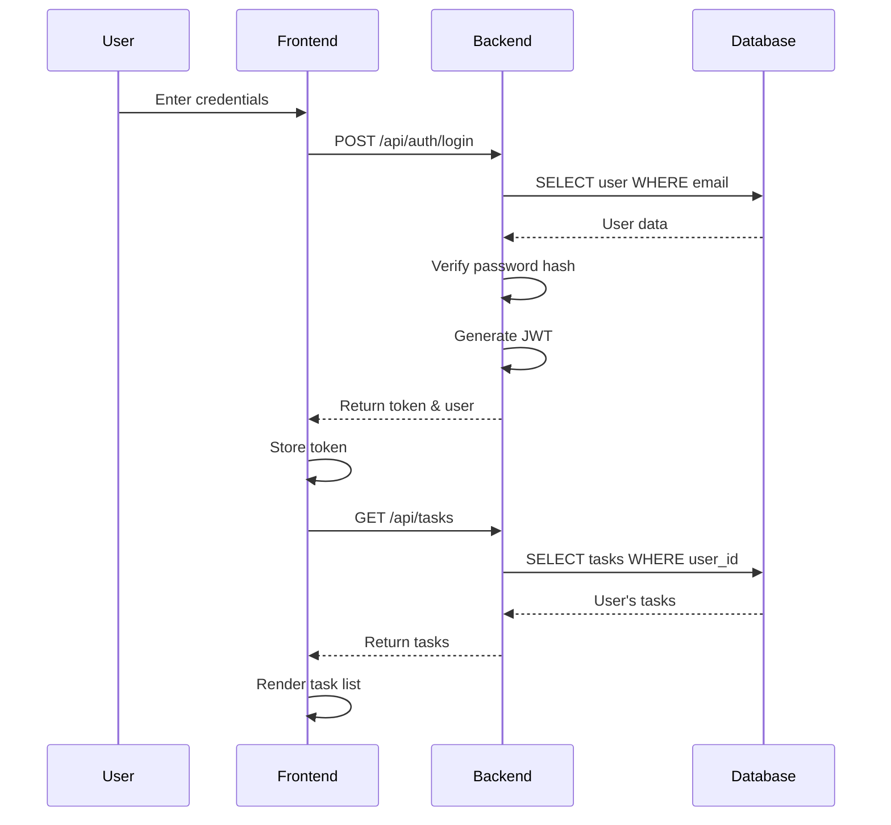
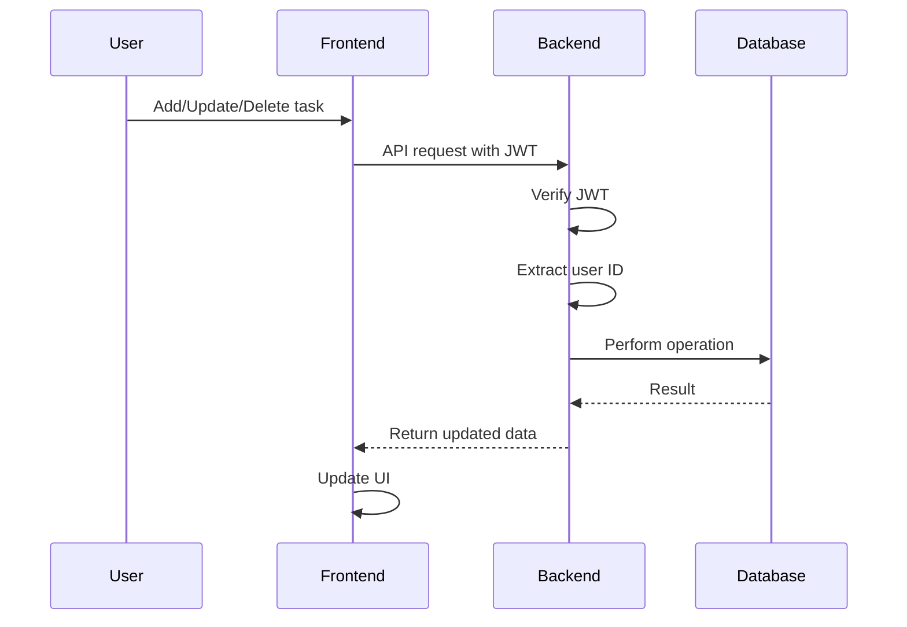

# Design Document

## Overview

This design adds user authentication and backend persistence to the existing to-do list application. The system will transition from a client-side-only application to a full-stack application with a Node.js/Express backend, PostgreSQL database, and JWT-based authentication. The frontend will be enhanced with authentication UI components while maintaining the existing task management functionality.

## Architecture

The application will use a client-server architecture:

### Frontend (Client)
- **Technology**: Vanilla JavaScript (ES6+), HTML5, CSS3
- **Responsibilities**: UI rendering, user input handling, API communication
- **Authentication**: JWT token storage and management
- **State Management**: User session state and task list state

### Backend (Server)
- **Technology**: Node.js with Express.js framework
- **Responsibilities**: Authentication, authorization, data persistence, API endpoints
- **Database**: PostgreSQL for user accounts and tasks
- **Security**: Password hashing (bcrypt), JWT tokens, CORS configuration

### Communication
- **Protocol**: RESTful HTTP API
- **Format**: JSON
- **Authentication**: Bearer token in Authorization header



## Components and Interfaces

### Frontend Components

#### AuthService
Handles authentication operations and token management:

```typescript
interface AuthService {
  register(email: string, password: string): Promise<AuthResponse>;
  login(email: string, password: string): Promise<AuthResponse>;
  logout(): void;
  getToken(): string | null;
  isAuthenticated(): boolean;
  getCurrentUser(): User | null;
}

interface AuthResponse {
  success: boolean;
  token?: string;
  user?: User;
  error?: string;
}

interface User {
  id: string;
  email: string;
  createdAt: string;
}
```

#### APIClient
Manages HTTP requests to the backend:

```typescript
interface APIClient {
  get(endpoint: string): Promise<Response>;
  post(endpoint: string, data: any): Promise<Response>;
  put(endpoint: string, data: any): Promise<Response>;
  delete(endpoint: string): Promise<Response>;
  setAuthToken(token: string): void;
}
```

#### AuthUI
Manages authentication UI components:

```typescript
interface AuthUI {
  showLoginForm(): void;
  showRegisterForm(): void;
  hideAuthForms(): void;
  displayError(message: string): void;
  displaySuccess(message: string): void;
  showLoadingState(): void;
  hideLoadingState(): void;
}
```

### Backend Components

#### Authentication Controller
Handles authentication endpoints:

```typescript
interface AuthController {
  register(req: Request, res: Response): Promise<void>;
  login(req: Request, res: Response): Promise<void>;
  getCurrentUser(req: Request, res: Response): Promise<void>;
}
```

#### Task Controller
Handles task CRUD operations:

```typescript
interface TaskController {
  getTasks(req: Request, res: Response): Promise<void>;
  createTask(req: Request, res: Response): Promise<void>;
  updateTask(req: Request, res: Response): Promise<void>;
  deleteTask(req: Request, res: Response): Promise<void>;
}
```

#### Authentication Middleware
Verifies JWT tokens:

```typescript
interface AuthMiddleware {
  verifyToken(req: Request, res: Response, next: NextFunction): void;
}
```

#### Database Service
Manages database operations:

```typescript
interface DatabaseService {
  // User operations
  createUser(email: string, passwordHash: string): Promise<User>;
  findUserByEmail(email: string): Promise<User | null>;
  findUserById(id: string): Promise<User | null>;
  
  // Task operations
  createTask(userId: string, description: string): Promise<Task>;
  getTasksByUserId(userId: string): Promise<Task[]>;
  updateTask(taskId: string, updates: Partial<Task>): Promise<Task>;
  deleteTask(taskId: string): Promise<boolean>;
  verifyTaskOwnership(taskId: string, userId: string): Promise<boolean>;
}
```

## Data Models

### User Model (Database)

```sql
CREATE TABLE users (
  id UUID PRIMARY KEY DEFAULT gen_random_uuid(),
  email VARCHAR(255) UNIQUE NOT NULL,
  password_hash VARCHAR(255) NOT NULL,
  created_at TIMESTAMP DEFAULT CURRENT_TIMESTAMP,
  updated_at TIMESTAMP DEFAULT CURRENT_TIMESTAMP
);

CREATE INDEX idx_users_email ON users(email);
```

### Task Model (Database)

```sql
CREATE TABLE tasks (
  id UUID PRIMARY KEY DEFAULT gen_random_uuid(),
  user_id UUID NOT NULL REFERENCES users(id) ON DELETE CASCADE,
  description TEXT NOT NULL,
  completed BOOLEAN DEFAULT FALSE,
  created_at TIMESTAMP DEFAULT CURRENT_TIMESTAMP,
  updated_at TIMESTAMP DEFAULT CURRENT_TIMESTAMP
);

CREATE INDEX idx_tasks_user_id ON tasks(user_id);
CREATE INDEX idx_tasks_user_completed ON tasks(user_id, completed);
```

### JWT Token Payload

```typescript
interface TokenPayload {
  userId: string;
  email: string;
  iat: number;  // Issued at
  exp: number;  // Expiration
}
```

## API Endpoints

### Authentication Endpoints

```
POST /api/auth/register
Body: { email: string, password: string }
Response: { token: string, user: User }

POST /api/auth/login
Body: { email: string, password: string }
Response: { token: string, user: User }

GET /api/auth/me
Headers: { Authorization: "Bearer <token>" }
Response: { user: User }
```

### Task Endpoints (All require authentication)

```
GET /api/tasks
Headers: { Authorization: "Bearer <token>" }
Response: { tasks: Task[] }

POST /api/tasks
Headers: { Authorization: "Bearer <token>" }
Body: { description: string }
Response: { task: Task }

PUT /api/tasks/:id
Headers: { Authorization: "Bearer <token>" }
Body: { description?: string, completed?: boolean }
Response: { task: Task }

DELETE /api/tasks/:id
Headers: { Authorization: "Bearer <token>" }
Response: { success: boolean }
```

## Data Flow

### Registration Flow


### Login Flow


### Task Operations Flow


## Correctness Properties

*A property is a characteristic or behavior that should hold true across all valid executions of a system—essentially, a formal statement about what the system should do. Properties serve as the bridge between human-readable specifications and machine-verifiable correctness guarantees.*

### Property 1: Registration creates unique users

*For any* valid email and password combination, registering should create a new user account, and attempting to register the same email again should be rejected.

**Validates: Requirements 1.1, 1.2**

### Property 2: Password minimum length enforcement

*For any* password string with fewer than 8 characters, registration should be rejected regardless of other input validity.

**Validates: Requirements 1.3**

### Property 3: Successful registration auto-login

*For any* successful registration, the user should be automatically authenticated with a valid session token.

**Validates: Requirements 1.4**

### Property 4: Valid credentials authenticate

*For any* registered user with correct credentials, login should succeed and return a valid JWT token.

**Validates: Requirements 2.1**

### Property 5: Invalid credentials rejection

*For any* login attempt with incorrect email or password, authentication should fail with an appropriate error message.

**Validates: Requirements 2.2**

### Property 6: Task isolation between users

*For any* two different authenticated users, the tasks returned for user A should not include any tasks belonging to user B.

**Validates: Requirements 5.1, 5.2**

### Property 7: Task ownership verification

*For any* task modification or deletion request, the backend should verify that the task belongs to the authenticated user before processing.

**Validates: Requirements 5.4, 5.5**

### Property 8: Logout clears session

*For any* authenticated user, logging out should clear the session token and prevent subsequent authenticated requests until re-login.

**Validates: Requirements 3.1, 3.2**

### Property 9: Token persistence across refresh

*For any* valid session token, refreshing the page should maintain authentication and restore the user's task list.

**Validates: Requirements 6.1, 6.2, 6.4**

### Property 10: Unauthorized request rejection

*For any* API request to protected endpoints without a valid token, the backend should reject the request with a 401 status code.

**Validates: Requirements 7.2, 7.3**

### Property 11: Password hashing security

*For any* user password stored in the database, the stored value should be a bcrypt hash, not the plaintext password.

**Validates: Requirements 7.4**

### Property 12: Task CRUD persistence

*For any* task operation (create, update, delete) performed by an authenticated user, the change should be persisted to the database and reflected in subsequent GET requests.

**Validates: Requirements 4.1, 4.2, 4.3, 4.4**

## Error Handling

### Frontend Error Handling

**Authentication Errors**
- Invalid credentials: Display "Invalid email or password"
- Email already exists: Display "An account with this email already exists"
- Weak password: Display "Password must be at least 8 characters"
- Network errors: Display "Unable to connect to server. Please try again."

**API Errors**
- 401 Unauthorized: Redirect to login page
- 403 Forbidden: Display "You don't have permission to perform this action"
- 404 Not Found: Display "Resource not found"
- 500 Server Error: Display "Server error. Please try again later."

**Token Expiration**
- Detect expired tokens and redirect to login
- Clear stored token on expiration
- Display "Your session has expired. Please log in again."

### Backend Error Handling

**Validation Errors**
- Return 400 Bad Request with specific error messages
- Validate email format, password length, required fields

**Authentication Errors**
- Return 401 Unauthorized for invalid credentials
- Return 401 for missing or invalid tokens

**Authorization Errors**
- Return 403 Forbidden when user attempts to access another user's resources

**Database Errors**
- Log errors server-side
- Return 500 Internal Server Error to client
- Implement retry logic for transient failures

**Duplicate Email**
- Catch unique constraint violation
- Return 409 Conflict with appropriate message

## Security Considerations

### Password Security
- Use bcrypt with salt rounds of 10 or higher
- Never log or expose passwords
- Enforce minimum password length of 8 characters

### Token Security
- Use strong JWT secret (minimum 256 bits)
- Set reasonable expiration (e.g., 7 days)
- Store tokens in httpOnly cookies or localStorage with caution
- Implement token refresh mechanism for long-lived sessions

### API Security
- Implement CORS with specific origin whitelist
- Use HTTPS in production
- Rate limiting on authentication endpoints
- Input validation and sanitization
- SQL injection prevention through parameterized queries

### Data Privacy
- Never expose password hashes in API responses
- Filter sensitive user data in responses
- Implement proper authorization checks on all endpoints

## Testing Strategy

### Unit Testing

**Frontend Tests** (Vitest + jsdom):
- AuthService: Token storage, retrieval, validation
- APIClient: Request formatting, header injection, error handling
- AuthUI: Form validation, error display, state management

**Backend Tests** (Vitest or Jest):
- Authentication controller: Registration, login logic
- Task controller: CRUD operations, ownership verification
- Middleware: Token verification, error handling
- Database service: Query correctness, data integrity

### Property-Based Testing

The application will use **fast-check** for property-based testing. Property-based tests will:

- Run a minimum of 100 iterations per property
- Use generators for random users, passwords, emails, tasks, and tokens
- Verify universal properties hold across all generated inputs
- Each property-based test will be tagged with: `**Feature: multi-user-auth, Property {number}: {property_text}**`

**Generators needed:**
- Random valid email addresses
- Random passwords (various lengths, characters)
- Random user IDs (UUIDs)
- Random task descriptions
- Random JWT tokens (valid and invalid)
- Random API request scenarios

### Integration Testing

- End-to-end authentication flows
- Task CRUD operations with authentication
- Session persistence across requests
- Multi-user isolation verification
- Error scenarios and recovery

### API Testing

- Test all endpoints with valid and invalid tokens
- Test authorization boundaries
- Test concurrent requests
- Test database transaction integrity

## Implementation Notes

### Technology Stack

**Backend:**
- Node.js (v18+)
- Express.js (web framework)
- PostgreSQL (database)
- bcrypt (password hashing)
- jsonwebtoken (JWT generation/verification)
- pg (PostgreSQL client)
- cors (CORS middleware)
- dotenv (environment configuration)

**Frontend:**
- Existing vanilla JavaScript codebase
- Fetch API for HTTP requests
- LocalStorage for token persistence

### Database Setup

- Use PostgreSQL hosted on Render or similar service
- Implement database migrations for schema management
- Use connection pooling for performance
- Set up proper indexes for query optimization

### Deployment Considerations

- Deploy backend as a separate Render web service
- Configure environment variables for secrets
- Set up PostgreSQL database on Render
- Update frontend to point to backend API URL
- Configure CORS to allow frontend origin
- Use HTTPS for all communication

### Migration Strategy

1. Deploy backend API alongside existing frontend
2. Update frontend to use API when authenticated
3. Maintain backward compatibility with local storage for unauthenticated users
4. Gradually migrate users to authenticated experience

### Performance Considerations

- Implement database connection pooling
- Add indexes on frequently queried columns
- Cache user data in memory where appropriate
- Implement pagination for large task lists
- Use compression for API responses

### Future Enhancements

- Password reset functionality
- Email verification
- OAuth integration (Google, GitHub)
- Two-factor authentication
- Task sharing between users
- Real-time updates with WebSockets
- Task categories and tags
- Search and filtering
