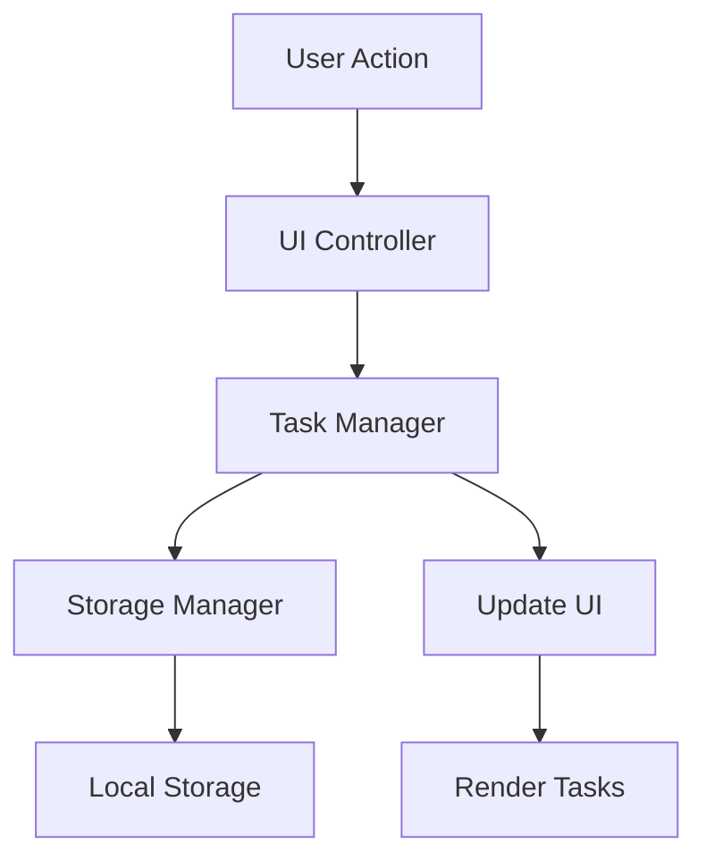

# Design Document

## Overview

The to-do list application is a client-side web application built with HTML, CSS, and JavaScript. It provides a simple, intuitive interface for managing daily tasks with persistent storage using the browser's Local Storage API. The application follows a component-based architecture with clear separation between data management, UI rendering, and user interaction handling.

## Architecture

The application uses a Model-View-Controller (MVC) pattern:

- **Model**: Task data structure and storage management
- **View**: DOM manipulation and UI rendering
- **Controller**: Event handling and coordination between model and view

All application logic runs in the browser with no backend server required. Data persistence is achieved through the Local Storage API, which provides synchronous key-value storage that persists across browser sessions.

## Components and Interfaces

### Task Model

```typescript
interface Task {
  id: string;           // Unique identifier (UUID or timestamp-based)
  description: string;  // Task description text
  completed: boolean;   // Completion status
  createdAt: number;    // Timestamp of creation
}
```

### Storage Manager

Responsible for all Local Storage operations:

```typescript
interface StorageManager {
  loadTasks(): Task[];
  saveTasks(tasks: Task[]): void;
  clearTasks(): void;
}
```

### Task Manager

Manages the task list state and operations:

```typescript
interface TaskManager {
  tasks: Task[];
  addTask(description: string): Task | null;
  deleteTask(id: string): boolean;
  toggleTaskCompletion(id: string): boolean;
  getTasks(): Task[];
}
```

### UI Controller

Handles DOM manipulation and event binding:

```typescript
interface UIController {
  renderTasks(tasks: Task[]): void;
  bindAddTask(handler: (description: string) => void): void;
  bindDeleteTask(handler: (id: string) => void): void;
  bindToggleTask(handler: (id: string) => void): void;
  clearInput(): void;
  showEmptyState(): void;
}
```

## Data Models

### Task Structure

Each task contains:
- **id**: Generated using `Date.now()` combined with a random component for uniqueness
- **description**: String with leading/trailing whitespace trimmed
- **completed**: Boolean defaulting to `false` on creation
- **createdAt**: Timestamp for potential future sorting/filtering features

### Storage Format

Tasks are stored in Local Storage as a JSON string under the key `"todoTasks"`:

```json
{
  "todoTasks": "[{\"id\":\"1234567890\",\"description\":\"Buy groceries\",\"completed\":false,\"createdAt\":1234567890}]"
}
```

## Data Flow




## Correctness Properties

*A property is a characteristic or behavior that should hold true across all valid executions of a system—essentially, a formal statement about what the system should do. Properties serve as the bridge between human-readable specifications and machine-verifiable correctness guarantees.*

### Property 1: Task addition increases list size

*For any* valid (non-whitespace) task description, adding it to the task list should result in the task list length increasing by one and the new task appearing in the list.

**Validates: Requirements 1.1**

### Property 2: Whitespace-only inputs are rejected

*For any* string composed entirely of whitespace characters (spaces, tabs, newlines, or combinations), attempting to add it as a task should be rejected, and the task list should remain unchanged.

**Validates: Requirements 1.2**

### Property 3: New tasks initialize as incomplete

*For any* valid task description, when a new task is created, its completed status should be false.

**Validates: Requirements 1.5**

### Property 4: Task completion toggle

*For any* task in the task list, toggling its completion status should change it from false to true or from true to false, and toggling twice should return it to its original state.

**Validates: Requirements 2.1, 2.3**

### Property 5: Completed tasks have visual distinction

*For any* task list containing both completed and incomplete tasks, the rendered DOM should contain different visual indicators (classes, styles, or attributes) for completed versus incomplete tasks.

**Validates: Requirements 2.2, 2.5**

### Property 6: Task deletion removes from list

*For any* task in the task list, deleting it should result in the task list length decreasing by one and the task no longer appearing in the list.

**Validates: Requirements 3.1**

### Property 7: UI reflects current task state

*For any* task list state, the rendered DOM should display all tasks with their current descriptions and completion statuses accurately reflected.

**Validates: Requirements 3.3, 5.1, 5.2**

### Property 8: Storage persistence round-trip

*For any* task list state, saving to local storage and then loading should produce an equivalent task list with all tasks and their properties preserved.

**Validates: Requirements 4.1**

### Property 9: Operations persist to storage

*For any* task operation (add, delete, toggle completion), the local storage should immediately reflect the updated task list state after the operation completes.

**Validates: Requirements 1.4, 2.4, 3.2, 4.4**

### Property 10: Corrupted storage handled gracefully

*For any* invalid or corrupted data in local storage (malformed JSON, invalid task objects, wrong data types), the application should initialize with an empty task list without throwing errors.

**Validates: Requirements 4.3**

### Property 11: Input field cleared after addition

*For any* valid task addition, the input field should be empty after the task is successfully added.

**Validates: Requirements 1.3**

## Error Handling

### Input Validation Errors
- Empty or whitespace-only task descriptions are silently rejected
- No error messages displayed to maintain clean UI
- Input field remains focused for user to try again

### Storage Errors
- JSON parse errors when loading from Local Storage result in empty task list initialization
- Storage quota exceeded errors are caught and logged to console
- Corrupted data structures are discarded and replaced with empty array

### DOM Errors
- Missing DOM elements are checked before manipulation
- Event listeners include error boundaries to prevent app crashes
- Graceful degradation if Local Storage is unavailable (in-memory only mode)

## Testing Strategy

### Unit Testing

The application will use **Vitest** as the testing framework for unit tests. Unit tests will cover:

- **Task validation logic**: Test specific examples of valid and invalid inputs
- **Storage manager**: Test JSON serialization/deserialization with specific task objects
- **Task manager operations**: Test add, delete, and toggle with known task states
- **Edge cases**: Empty lists, single-item lists, duplicate operations
- **Error conditions**: Corrupted storage data, missing DOM elements

### Property-Based Testing

The application will use **fast-check** for property-based testing in JavaScript. Property-based tests will:

- Run a minimum of 100 iterations per property
- Use generators to create random task descriptions, task lists, and application states
- Verify universal properties hold across all generated inputs
- Each property-based test will be tagged with a comment in this format: `**Feature: todo-list, Property {number}: {property_text}**`
- Each correctness property listed above will be implemented as a single property-based test

**Generators needed:**
- Random task descriptions (various lengths, characters, unicode)
- Random whitespace strings (spaces, tabs, newlines, combinations)
- Random task lists (empty, single item, multiple items)
- Random task IDs
- Random boolean values for completion status
- Corrupted JSON strings and invalid task objects

### Integration Testing

- Test complete user workflows: add → complete → delete
- Test persistence across simulated page reloads
- Test UI updates in response to state changes

## Implementation Notes

### Technology Stack
- **HTML5**: Semantic markup for accessibility
- **CSS3**: Modern styling with flexbox/grid for layout
- **Vanilla JavaScript (ES6+)**: No framework dependencies for simplicity
- **Local Storage API**: Built-in browser persistence

### Browser Compatibility
- Target modern browsers with ES6 support (Chrome, Firefox, Safari, Edge)
- Local Storage is widely supported (IE8+)
- No polyfills required for target browsers

### Performance Considerations
- Local Storage operations are synchronous but fast for small datasets
- Limit task list to reasonable size (< 1000 tasks) for optimal performance
- Debounce rapid operations if needed
- Use event delegation for task list interactions

### Accessibility
- Semantic HTML elements (button, input, ul/li)
- ARIA labels for screen readers
- Keyboard navigation support
- Focus management for task operations

### Future Enhancements
- Task editing capability
- Task reordering (drag and drop)
- Task filtering (show all/active/completed)
- Task due dates and priorities
- Multiple task lists
- Cloud synchronization
